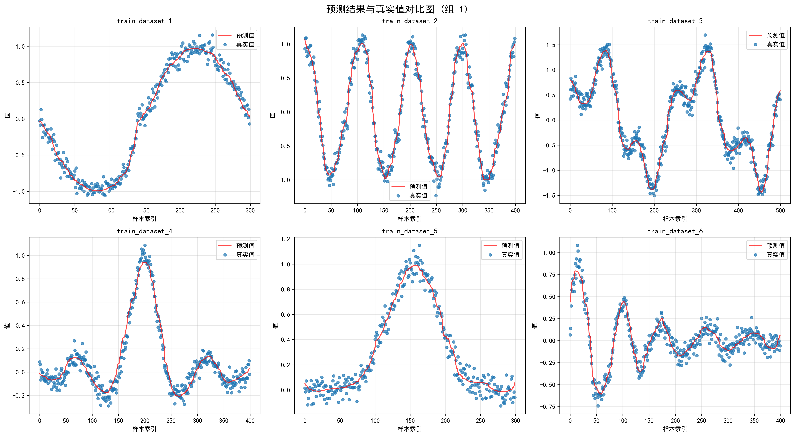
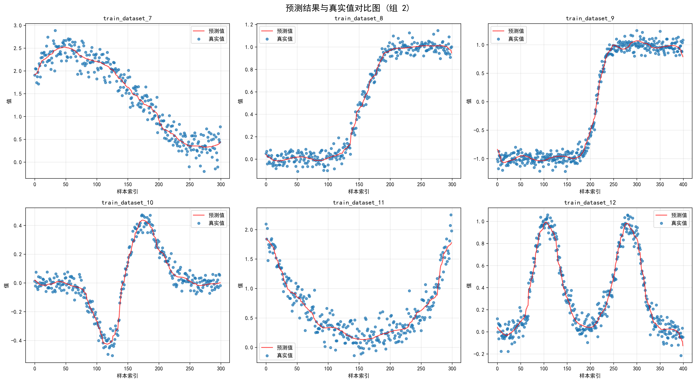
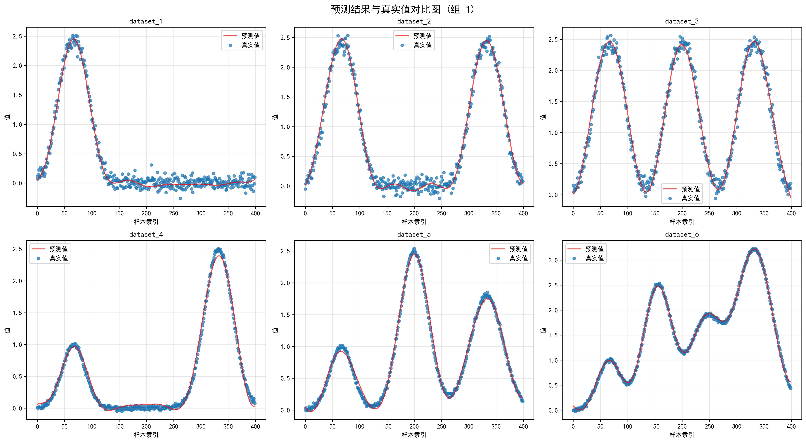
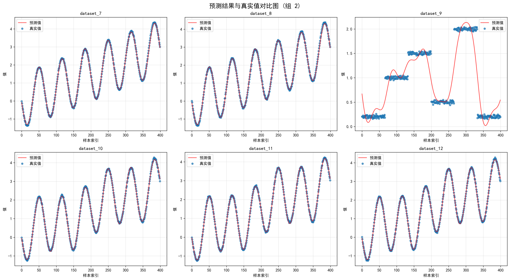
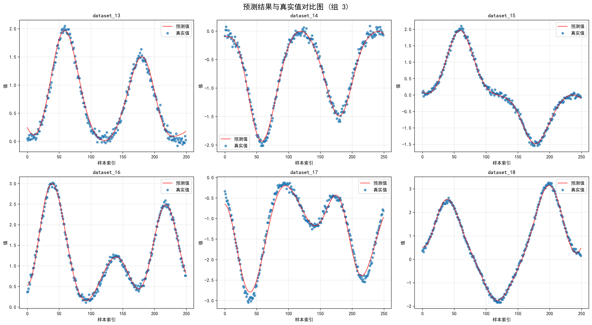
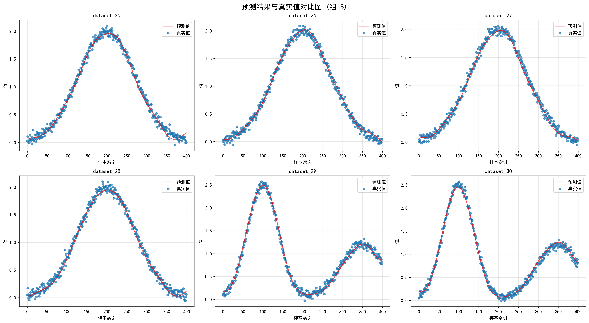
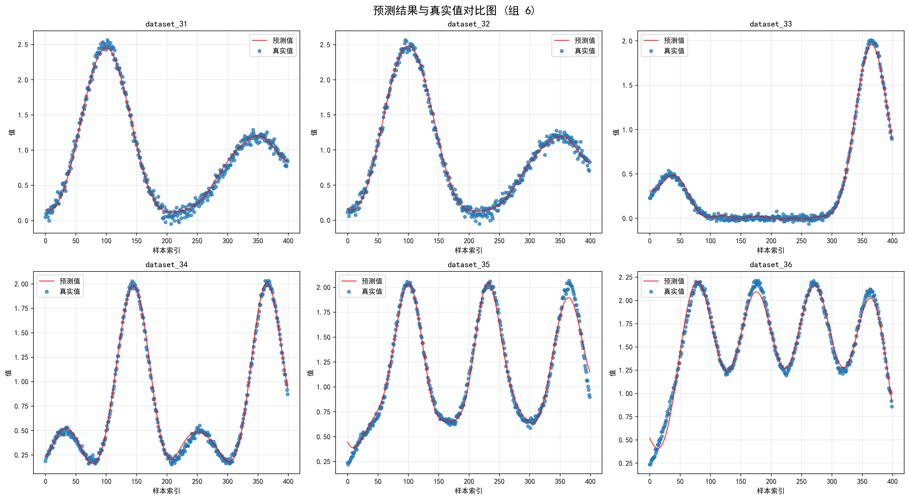
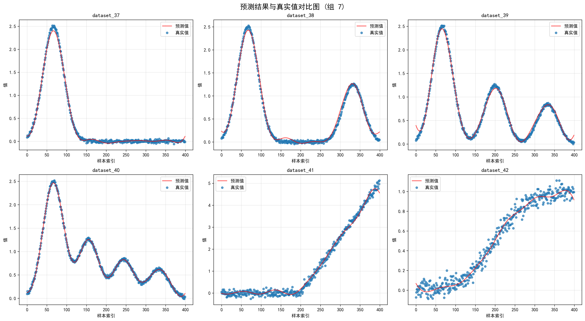
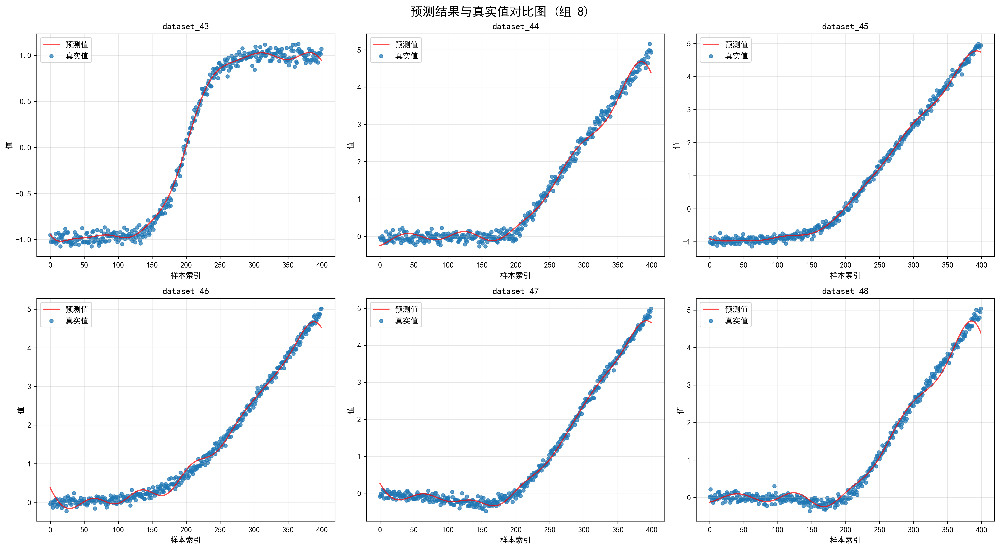

# 项目说明

这是本人第三次先进计算大赛光量子技术创新赛道的初赛作品，下面数据大部分都是在25轮次或者更低轮次的学习下可以获得的，它们的学习能力并没有发挥到极限，但我们认为它有充分的潜力可以发挥到极限，在一些数据集上我们的多轮次训练结果也证明了这一点。

我们发现对于x敏感的高频信号或者变化较大的信号，增大倍频输入，更有利于模型捕捉输入差异，以达到更好的学习结果。而对于低频信号则相反，我们的模型使用了组合的方法，以求兼顾不同信号，在我们的测试中证明其有效。

另一个创新点deep，我们用编码111态来做特征提取，以牺牲信息为代价提取信息，以让网络自己去学习丢弃和需要关注的特征图。

此外还采用了残差链接，这是用于避免BP问题，同时保留原始信息，以增强上下两层的分化能力。

# 环境依赖

## Python版本

- Python 3.7+

## 核心依赖库

- deepquantum: 量子计算库
- torch>=1.9.0: PyTorch深度学习框架
- numpy>=1.21.0: 数值计算库
- pandas>=1.3.0: 数据处理库
- scikit-learn>=1.0.0: 机器学习库
- matplotlib>=3.4.0: 绘图库

## 安装依赖

可以通过以下命令安装所有依赖：

```bash
pip install -r requirements.txt
```

# 项目结构

## 1. 数据集说明

项目下包含12组未经分割的官方数据集：

- 训练集: `Datasets/train_datasets/train_dataset_1.csv` 到 `train_dataset_12.csv`
- 测试集: 无(默认放置与训练集相同的12个数据集)

每组数据集包含两列数据：

- 第一列(x): 输入特征
- 第二列(y): 目标输出

## 2. 模型架构

### 量子线路设计

- 总共使用6个量子比特
- 前3个量子比特(0,1,2)用于输入编码和输出测量
- 后3个量子比特(3,4,5)作为辅助比特参与计算

### 变分参数

- 模型总共包含36个变分参数
- 参数范围初始化为[0, 2π]

### 训练配置

- 训练轮数: 25轮
- 批大小: 16
- 学习率: 初始0.1，每5轮衰减一半(γ=0.5)
- 损失函数: 均方误差(MSE)
- 优化器: Adam优化器

## 3. 文件功能说明

### model.py

- 定义量子线路和光量子神经网络模型PhotonicNeuralNetwork
- 实现模型训练和评估函数
- 包含数据预处理和加载逻辑

### train.py

- 提供完整的训练流程
- 使用命令行参数或者直接运行train.py文件以训练/测试对应的数据集
- 保存详细的训练结果和模型权重
- 生成可视化图表

# 运行指南

## 1. 基础训练

使用默认配置训练所有12个数据集：

```bash
python train.py
```

## 2. 指定数据集训练

```bash
# 训练所有12个数据集（显式指定）
python train.py --all

# 使用特定训练集和对应的测试集
python train.py --train-dataset Datasets/train_datasets/train_dataset_5.csv --test-dataset Datasets/test_datasets/train_dataset_5.csv

# 同时指定训练集和测试集
python train.py --train-dataset Datasets/train_datasets/train_dataset_3.csv --test-dataset Datasets/test_datasets/train_dataset_3.csv
```

## 3. 自定义结果保存路径

```bash
# 指定自定义结果保存目录
python train.py --train-dataset Datasets/train_datasets/train_dataset_1.csv --test-dataset Datasets/test_datasets/train_dataset_1.csv --result-dir CustomResults
```

## 4. 组合使用多个选项

```bash
# 训练指定数据集并保存到自定义目录
python train.py --train-dataset Datasets/train_datasets/train_dataset_7.csv --test-dataset Datasets/test_datasets/train_dataset_7.csv --result-dir MyResults
```

## 5. 查看所有命令行选项

```bash
python train.py --help
```

命令行参数说明：

- `--train-dataset`: 指定训练数据集路径
- `--test-dataset`: 指定测试数据集路径
- `--result-dir`: 指定结果保存目录（默认为 "Result"）
- `--all`: 训练所有12个数据集

# 测试结果

## 1. 在给定的12个数据集上训练25轮的训练结果

提升训练轮次或者改变倍频信号可以提升训练效果，这已经在我们额外的实验中得到验证。

| 数据集 | 测试集MAE  | 测试集MSE  | 测试集RMSE | 最终训练损失 | 训练时间(秒) |
|--------|-----------|-----------|------------|-------------|-------------|
| 1      | 0.028550  | 0.006278  | 0.079233   | 0.001297    | 149.82      |
| 2      | 0.033121  | 0.009781  | 0.098899   | 0.001810    | 197.08      |
| 3      | 0.029454  | 0.014675  | 0.121140   | 0.001518    | 244.54      |
| 4      | 0.035085  | 0.003808  | 0.061711   | 0.002104    | 206.59      |
| 5      | 0.040833  | 0.003970  | 0.063006   | 0.002502    | 148.71      |
| 6      | 0.032923  | 0.005969  | 0.077262   | 0.001845    | 196.98      |
| 7      | 0.050092  | 0.036163  | 0.190165   | 0.003879    | 148.49      |
| 8      | 0.030289  | 0.002364  | 0.048624   | 0.001565    | 147.84      |
| 9      | 0.029145  | 0.008461  | 0.091981   | 0.001409    | 197.61      |
| 10     | 0.032710  | 0.001568  | 0.039595   | 0.001662    | 159.68      |
| 11     | 0.053854  | 0.026312  | 0.162209   | 0.004602    | 175.49      |
| 12     | 0.041277  | 0.004315  | 0.065686   | 0.002698    | 280.64      |

可视化学习效果如下，图中蓝色散点图为数据集标签，红线为学习结果。

<div align="center">
  <h3>第一组</h3>
  
  
  <h3>第二组</h3>
  
</div>

## 2. 泛化能力验证(自定义数据集)

我们在40个不同类型的数据集上同样使用lr=0.1，25轮次训练的配置进行了测试，这些数据集包含了对称、不对称、周期性、非周期性等不同类型的函数，结果表明模型的泛化能力较强。

<div align="center">
  <h3>第一组</h3>
  
  
  <h3>第二组</h3>
  
  
  <h3>第三组</h3>
  
  
  <h3>第四组</h3>
  
  
  <h3>第五组</h3>
  
  
  <h3>第六组</h3>
  
  
  <h3>第七组</h3>
  
  
  <h3>第八组</h3>
  
</div>


# 其他信息

作者邮箱：zsc1464@stu.ouc.edu.cn

创作时间：2025.12